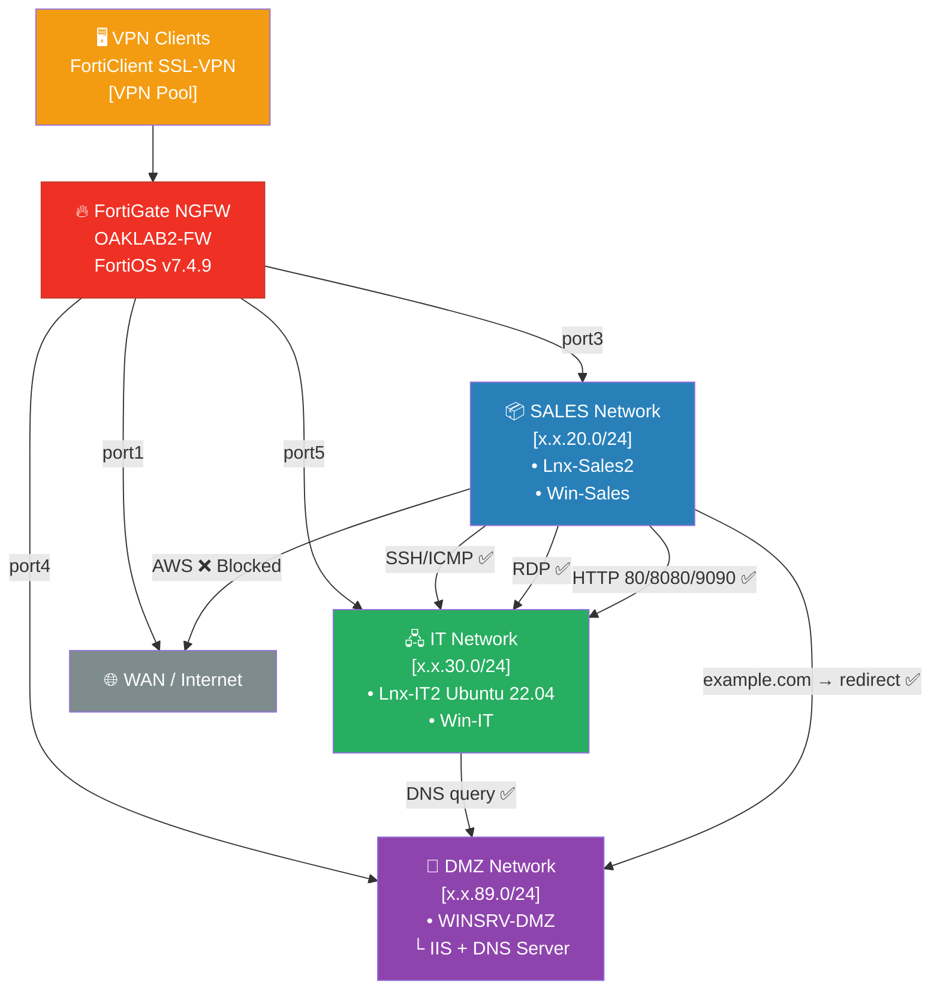

# 🔥 Enterprise Firewall Engineering Lab — FortiGate Next-Generation Firewall


> **A hands-on, enterprise-grade firewall engineering project** demonstrating real-world configuration of a FortiGate Next-Generation Firewall (NGFW). Covers policy design, traffic segmentation, VPN, Virtual IP / Port Forwarding, Application Control, Web Filtering, IPS, Antivirus, and DNS Filtering — all built under a strict **Least Privilege** security model.

> 📄 **[View Full Presentation (PDF)](./FortiGate_Portfolio_SAFE.pdf)** — slide-by-slide walkthrough of all 14 tasks with screenshots and diagrams.

---

## 📋 Table of Contents

- [Project Overview](#-project-overview)
- [Network Architecture](#-network-architecture)
- [Technology Stack](#-technology-stack)
- [Tasks Completed](#-tasks-completed)
  - [1. Linux SSH + ICMP Policy](#1-linux-ssh--icmp-policy-sales--it)
  - [2. Windows RDP Policy](#2-windows-rdp-policy-sales--it)
  - [3. Web Server Deployment & Access Policy](#3-web-server-deployment--access-policy)
  - [4. Virtual IP & Port Forwarding](#4-virtual-ip--port-forwarding)
  - [5. Internet Access Policies](#5-internet-access-policies)
  - [6. URL-Based Traffic Restriction (SALES)](#6-url-based-traffic-restriction-sales)
  - [7. AWS Service Blocking (IT)](#7-aws-service-blocking-it)
  - [8. Application Control](#8-application-control)
  - [9. Web Filtering](#9-web-filtering)
  - [10. Antivirus — EICAR Test](#10-antivirus--eicar-test)
  - [11. IPS — Intrusion Prevention](#11-ips--intrusion-prevention)
  - [12. DNS Filter & DMZ Redirect](#12-dns-filter--dmz-redirect)
  - [13. Private DNS Server (DMZ Windows Server)](#13-private-dns-server-dmz-windows-server)
  - [14. Log Filtering per Policy](#14-log-filtering-per-policy)
- [Key Security Principles](#-key-security-principles)
- [Skills Demonstrated](#-skills-demonstrated)
- [Lessons Learned](#-lessons-learned)

---

## 🧭 Executive Summary

| | |
|---|---|
| **What I built** | A fully segmented enterprise firewall environment on a live FortiGate NGFW (FortiOS v7.4.9), covering 14 real-world security engineering tasks from policy design to advanced threat prevention. |
| **Why** | To demonstrate hands-on competency in enterprise network security — the kind of work a Security Engineer does day-to-day in a corporate environment. |
| **How validated** | Every task was verified through FortiGate traffic logs, terminal output (curl, nmap, nslookup), and live browser tests. No task is marked complete without log evidence. |
| **Key skills** | FortiGate policy management, VPN, Virtual IP/NAT, App Control (L7), Web Filtering, IPS, Antivirus, DNS Filtering, log analysis |
| **Environment** | Isolated lab — SALES / IT / DMZ segments + SSL-VPN. All IPs and credentials redacted in screenshots. |

---

## 🎯 Project Overview

This project simulates the responsibilities of a **Security Engineer** managing firewall infrastructure in a multi-segment corporate network. Each configuration was completed on a live FortiGate appliance (FortiOS v7.4.9) and verified through traffic logs.

The project strictly follows:
- **Least Privilege Principle** — every policy allows only the minimum required access
- **No any-any rules** — all policies are source/destination/service specific
- **Full logging** — every policy rule includes log filtering and verification
- **Conflict management** — deny policies were disabled after testing to prevent rule overlap

---

## 🏗 Network Architecture

```
                    ┌──────────────────────────────────────────────┐
                    │         FortiGate NGFW (FortiOS v7.4.9)       │
                    │                OAKLAB2-FW                      │
                    └───────┬──────────────┬──────────────┬─────────┘
                            │              │              │
              ┌─────────────▼──┐   ┌───────▼──────┐  ┌───▼──────────────┐
              │  SALES Network  │   │  IT Network  │  │   DMZ Network    │
              │   (port3)       │   │   (port5)    │  │                  │
              │                 │   │              │  │  WINSRV-DMZ      │
              │ • Lnx-Sales2    │   │ • Lnx-IT2    │  │  ├─ IIS Server   │
              │ • Win-Sales      │   │   (Ubuntu    │  │  └─ DNS Server   │
              │                 │   │    22.04)    │  │   (lab.local)    │
              └─────────────────┘   │ • Win-IT     │  └──────────────────┘
                                    │   (Windows)  │
                                    └──────────────┘
                                                           ▲
                         VPN Clients ─────────────────────┘
                         (FortiClient SSL-VPN)
```



| Segment | Role | Accessible Services |
|--------|------|-------------------|
| SALES Network | End-user workstations | SSH/ICMP to IT Linux, RDP to IT Windows, Filtered Internet |
| IT Network | Infrastructure servers | Web server (80/8080/9090), Full Internet (AWS blocked) |
| DMZ Network | Public-facing & internal services | IIS Web Server, DNS Server (lab.local) |
| VPN | Remote access for testing | Tunneled into internal segments |

---

## 🛠 Technology Stack

| Technology | Version / Details |
|-----------|-----------------|
| **Firewall** | FortiGate NGFW — FortiOS v7.4.9 |
| **VPN Client** | FortiClient SSL-VPN |
| **Web Server** | Apache / Python3 `http.server` (ports 80, 8080, 9090) |
| **DNS Server** | Windows Server DNS Role (lab.local zone) |
| **Web Server (DMZ)** | IIS on Windows Server |
| **OS — Linux** | Ubuntu 22.04 LTS |
| **OS — Windows** | Windows Server (DMZ), Windows Desktop (SALES/IT) |
| **Security Testing** | EICAR test file, Nmap (-A scan), FortiGuard signatures |

---

## ✅ Tasks Completed

---

### 1. Linux SSH + ICMP Policy (SALES → IT)

**Goal:** Allow only SSH (TCP/22) and ICMP traffic from SALES Linux machines to IT Linux machines. No other traffic permitted.

**Configuration:**
- Created custom service objects: `FiratCanBekar-SSH` (TCP/22) and `FiratCanBekar-ICMP` (ICMP Type 0, Code 0)
- Policy `FiratCanBekar-SALES Linux>IT Linux` (ID: 26):
  - Source: `SALES_LINUXnet` (SALES Network, port3)
  - Destination: `IT_LINUXnet` (IT Network, port5)
  - Services: `SSH + ICMP`
  - Action: **ACCEPT**
  - Logging: **Enabled**

**Verification:**
- VPN connected as `interns` → `ping` to IT Linux host → **ICMP replies received**
- `ssh oaklab@[IT-Linux-IP]` → **Connection successful** (Ubuntu 22.04.5 banner confirmed)
- FortiGate traffic logs: Source VPN IP → IT Linux destination, Policy `VPN-IT(14)` → **ACCEPT**

> 📸 *Screenshots: Policy list, custom service objects, terminal SSH session, FortiGate traffic log*

---

### 2. Windows RDP Policy (SALES → IT)

**Goal:** Allow only RDP (TCP/3389) from SALES Windows machines to IT Windows machines.

**Configuration:**
- Created custom service: `FiratCanBekar-RDP` (TCP/3389)
- Policy `FiratCanBekar-SALES Win>IT Win` (ID: 32):
  - Source: SALES Network → Destination: IT Network
  - Service: `TCP/3389` only
  - NAT: **Enabled** (Preserve Source Port)
  - Action: **ACCEPT**

**Verification:**
- RDP connection from VPN client (10.212.134.x) → Win-IT machine → **Session established**
- FortiGate logs confirmed: `VPN-IT(14)` policy hit, port 3389, **ACCEPT**

> 📸 *Screenshots: Policy configuration (FiratCanBekar-SALES Win>IT Win), traffic log confirming RDP TCP/3389 — ACCEPT*

---

### 3. Web Server Deployment & Access Policy

**Goal:** Deploy a web server on IT Linux (ports 80, 8080, 9090) and allow SALES network access. Verify via both firewall and server-side logs.

**Web Server Deployment (IT Linux — Ubuntu 22.04):**
```bash
# Port 80
sudo python3 -m http.server 80

# Port 8080
sudo python3 -m http.server 8080

# Port 9090
sudo python3 -m http.server 9090

# Apache (alternative)
sudo systemctl start apache2
```

**Firewall Configuration:**
- Custom services: `FiratCanBekar-HTTP` (80), `FiratCanBekar-HTTP8080` (8080), `FiratCanBekar-HTTP9090` (9090)
- Policy `SALES_TO_IT_LINUX_WEB` (ID: 33):
  - Source: `SALES_SUBNET` → Destination: `IT_SUBNET`
  - Services: HTTP + TCP/8080 + TCP/9090
  - Action: **ACCEPT**

**Verification:**
```bash
# From SALES / VPN client:
curl http://[IT-Linux]:80    # → Directory listing: 200 OK
curl http://[IT-Linux]:8080  # → Directory listing: 200 OK
curl http://[IT-Linux]:9090  # → Directory listing: 200 OK
```
- Python3 http.server terminal showed incoming GET requests per client IP
- FortiGate logs: `VPN-IT(14)` policy, HTTP/8080/9090 traffic → **ACCEPT**

> 📸 *Screenshots: Policy config, curl output, python3 server access log, FortiGate traffic log*

---

### 4. Virtual IP & Port Forwarding

**Goal:** Configure a Virtual IP (VIP) object to expose the IT Linux web server on a dedicated SALES-side IP via port forwarding, without requiring direct IT network access.

**Configuration:**
- VIP Object: `VIP_SALES_TO_IT_LINUX_8080`
  - External IP: `[SALES-facing VIP address]:8080`
  - Mapped IP: `[IT-Linux IP]:8080`
  - Protocol: TCP / Port Forwarding enabled
- Policy: `SALES_TO_IT_LINUX_VIP`
  - Source: `SALES_SUBNET`
  - Destination: VIP object
  - Service: TCP/8080
  - Action: **ACCEPT**

**How it works:**
```
SALES Client → [VIP External IP]:8080
                    ↓ (FortiGate NAT/PAT)
             [IT Linux Internal IP]:8080
```

**Verification:**
- `curl http://[VIP-IP]:8080` from SALES → **200 OK, directory listing returned**
- FortiGate traffic log (Policy ID: 34): VIP translation confirmed, source SALES_SUBNET, destination IT Linux

> 📸 *Screenshots: VIP object config, port forwarding rules, curl test from SALES, log showing VIP translation*

---

### 5. Internet Access Policies

**Goal:** Provide unrestricted internet access for both SALES and IT networks (separate policies per segment for granular control).

**Configuration:**
- `FiratCanBekar-SALES-TO-INTERNET` (ID: 35):
  - Source: SALES Network → WAN
  - Service: ALL
  - NAT: **Enabled**
  - Action: **ACCEPT**
- `FiratCanBekar-ALLOW_IT_TO_INTERNET`:
  - Source: IT Network → WAN
  - Service: ALL
  - NAT: **Enabled**
  - Action: **ACCEPT**

**Verification:**
- SALES machines: browsed to Google, Microsoft — **ACCEPT** (VPN-INTERNET policy)
- IT machines: general internet access confirmed before AWS block policy (Task 7)

> 📸 *Screenshots: Both policies in policy list, traffic logs showing accepted internet traffic*

---

### 6. URL-Based Traffic Restriction (SALES)

**Goal:** Block access to specific destinations (`example.com` and `1.1.1.1`) for all SALES network machines while keeping general internet access active.

**Configuration:**
- Address object: `BLOCK_1.1.1.1` → subnet `1.1.1.1/32`
- Address object: `BLOCK_example.com` → FQDN `example.com`
- Policy `DENY_SALES_TO_example.com`:
  - Source: `SALES_SUBNET` → Destination: `example.com`
  - Services: HTTP + HTTPS
  - Action: **DENY**
  - Logging: **Enabled** (critical for deny rule visibility)
- Policy `DENY_SALES_TO_1.1.1.1`:
  - Source: `SALES_SUBNET` → Destination: `1.1.1.1/32`
  - Service: ALL
  - Action: **DENY**

> ⚠️ *Deny policies were disabled after verification to prevent interference with other rules (per least-privilege conflict management)*

**Verification:**
- `curl http://example.com` from SALES → **Connection refused / timeout**
- `ping 1.1.1.1` from SALES → **No reply**
- FortiGate deny logs: source SALES IP, destination `example.com` / `1.1.1.1` → **DENY** entries confirmed
- Same machine accessed Google.com → **ACCEPT** (internet policy still functional)

> 📸 *Screenshots: Deny policy configs, blocked curl/ping output, deny log entries, allow log for other sites*

---

### 7. AWS Service Blocking (IT)

**Goal:** Allow IT network internet access but specifically block all AWS service endpoints (ec2.amazonaws.com, etc.).

**Configuration:**
- Address object: AWS FQDN addresses (`*.amazonaws.com`, `ec2.amazonaws.com`)
- Policy `DENY_IT_TO_AWS`:
  - Source: IT_SUBNET → Destination: AWS address group
  - Service: ALL
  - Action: **DENY**
  - *Placed above the general IT internet allow policy in policy order*

**Verification:**
- IT Linux: `curl https://ec2.amazonaws.com` → **Connection blocked**
- FortiGate deny logs: IT source IP → amazonaws.com → **DENY** confirmed
- Non-AWS traffic from IT: still **ACCEPT** via general internet policy

> 📸 *Screenshots: DENY_IT_TO_AWS policy, log showing blocked AWS traffic, normal internet still working*

---

### 8. Application Control

**Goal:** Block specific applications (Instagram, Gmail, Facebook) for IT Windows machines using FortiGate Application Control signatures — regardless of port or protocol.

**Configuration:**
- App Control Sensor: `BLOCK_SOCIAL_API`
  - Applications: **Facebook → Block**, **Instagram → Block**, **Gmail → Block**
  - Action: **Block** (with logging)
- Policy `IT_TO_INT_APP_CONTRI`:
  - Source: IT Network → WAN
  - Security Profile: `BLOCK_SOCIAL_API` attached
  - Deep Packet Inspection enabled

**Why App Control?**
Unlike simple port-based blocking, Application Control identifies traffic by its application signature (SSL/TLS deep inspection). Instagram over HTTPS on port 443 is correctly identified and blocked — a port-based rule would miss this.

**Verification:**
- IT Windows: Browser → `facebook.com` → **Blocked by FortiGuard App Control**
- IT Windows: Browser → `instagram.com` → **Blocked**
- IT Windows: Browser → `mail.google.com` → **Blocked**
- FortiGate application logs: entries showing `Facebook/Instagram/Gmail` → **DENY** by `BLOCK_SOCIAL_API` sensor

> 📸 *Screenshots: App Control sensor config (block list), policy with sensor attached, browser blocked page, app control logs*

---

### 9. Web Filtering

**Goal:** Enable content-based web filtering for all SALES network machines using FortiGuard Web Filtering categories.

**Configuration:**
- Web Filter Profile: `SALES_WEB_FILTER`
  - Categories blocked:
    - 🚫 **Gambling**
    - 🚫 **Pornography / Adult Content**
    - 🚫 **Social Networking**
    - 🚫 **Online Games**
  - Action per category: **Block** (FortiGuard redirect page shown)
- Policy `SALES_TO_WEB_FILTER`:
  - Source: SALES Network → WAN
  - Security Profile: `SALES_WEB_FILTER` attached

**Verification:**
- `facebook.com` → **Blocked** (Social Networking category)
- `bet365.com` → **Blocked** (Gambling category)
- FortiGate web filter logs: category labels visible alongside blocked URLs

> 📸 *Screenshots: Web filter profile with blocked categories, test browser showing FortiGuard block page, web filter traffic logs*

---

### 10. Antivirus — EICAR Test

**Goal:** Enable the Antivirus module and verify it detects and blocks the industry-standard EICAR test file download.

**Configuration:**
- AV Profile: `SALES_ANTIVIRUS`
  - Protocols scanned: **HTTP, SMTP, POP3**
  - Action: **Block**
  - SSL Certificate Inspection: **Enabled** (to scan HTTPS traffic)
- Policy `SALES_ANTIVIRUS`:
  - Source: SALES Network → WAN
  - Security Profile: `SALES_ANTIVIRUS` attached

**EICAR Test:**
```
Test URL: http://www.eicar.org/download/eicar.com
File content (safe to share): X5O!P%@AP[4\PZX54(P^)7CC)7}$EICAR-STANDARD-ANTIVIRUS-TEST-FILE!$H+H*
```

**Verification:**
- SALES client: attempted download from `www.eicar.org` → **File blocked by FortiGate AV**
- Browser showed FortiGuard AV block page
- FortiGate AV logs: EICAR signature detected, action = **Block**

> 📸 *Screenshots: AV profile config, browser AV block page, AV log entry with EICAR signature name*

---

### 11. IPS — Intrusion Prevention System

**Goal:** Enable IPS and demonstrate detection/blocking of malicious inter-subnet traffic (simulated with Nmap scanning).

**Configuration:**
- IPS Sensor: Enabled with FortiGuard signature database (17,846+ signatures)
- Threat categories: Network Scanning, Exploit attempts, Nmap scripts
- Applied to inter-subnet policies

**Attack Simulation:**
```bash
# From Lnx-Sales2 (SALES Network):
nmap -A [IT-Linux-IP]
```

**Verification:**
- Nmap scan triggered IPS signatures:
  - `Port.Scanning` → **Dropped**
  - `Nmap.Script.Scanner` → **Dropped**
  - `Java.Debug.Wire.Protocol.Detection` → **Dropped**
- FortiGate IPS logs: source SALES IP, attack signatures listed, action = **Drop**
- Scanning host received no response (traffic silently dropped at the firewall)

> 📸 *Screenshots: IPS sensor config, nmap terminal showing no results, IPS log entries with signature names and drop action*

---

### 12. DNS Filter & DMZ Redirect

**Goal:** Use FortiGate DNS Filter to intercept DNS queries for `example.com` and redirect resolution to the internal DMZ web server (IIS on Windows Server).

**Configuration:**
- DNS Filter Profile: `DNS_REDIRECT_EXAMPLE`
  - Domain: `example.com`
  - Action: **Redirect** → `[DMZ Windows Server IP]` (BlockPortal / IIS)
- Policy `SALES_WAN_DNS_Redirect` (ID: 39):
  - Source: SALES Network → WAN
  - DNS Filter profile attached
  - Action: **ACCEPT** (DNS filter handles the redirect transparently)

**How it works:**
```
SALES Client → DNS query: "example.com"
                    ↓ (FortiGate DNS Filter intercepts)
              Returns: [DMZ IIS Server IP]  ← instead of real example.com IP
                    ↓
              Browser connects to internal IIS page
```

**Verification:**
- SALES client: `curl http://example.com` → **Response from IIS (internal DMZ page)**
- PowerShell: `Invoke-WebRequest http://example.com` → **Status: 200 OK** (from IIS)
- FortiGate DNS filter logs: `example.com` → redirected to DMZ IP

> 📸 *Screenshots: DNS filter profile, policy config, browser/curl showing IIS page instead of example.com, DNS filter logs*

---

### 13. Private DNS Server (DMZ Windows Server)

**Goal:** Install DNS Server role on DMZ Windows Server, create a private zone (`lab.local`), add an A record for the web server, and configure SALES clients to resolve internal hostnames via this DNS server.

**DNS Server Setup (WINSRV-DMZ):**
1. Installed **DNS Server role** via Windows Server Manager
2. Created **Forward Lookup Zone**: `lab.local` (Standard Primary)
3. Added **A Record**: `web.lab.local` → `[IT-Linux IP]`

**FortiGate Configuration:**
- Policy allowing SALES → DMZ DNS traffic (UDP/TCP 53)
- DNS queries from SALES pointed to DMZ DNS server IP

**Verification:**
```bash
# From Lnx-Sales2:
nslookup web.lab.local [DMZ-DNS-IP]
# Output: Name: web.lab.local
#         Address: [IT-Linux IP]  ✅

curl http://web.lab.local
# Output: "Web Server Running on Port 80"  ✅
```
- FortiGate logs: `web.lab.local` DNS traffic → `VPN-IT(14)` policy → **ACCEPT**

> 📸 *Screenshots: DNS Manager with lab.local zone and A record, nslookup terminal output, curl to web.lab.local result, FortiGate log*

---

### 14. Log Filtering per Policy

**Goal:** For every policy created, perform log filtering in FortiGate to isolate and verify traffic hits specific to that rule.

**Methodology applied for each policy:**
- Navigate to **Log & Report → Forward Traffic**
- Filter by: **Policy ID**, **Source IP**, **Destination IP**, **Application**, **Action**
- Confirm expected entries (ACCEPT or DENY) are present

**Examples of log filters applied:**

| Policy | Filter Used | Result |
|--------|------------|--------|
| SALES Linux → IT Linux | Policy ID: 26, proto: SSH/ICMP | ACCEPT entries ✅ |
| SALES Win → IT Win | Policy ID: 32, dest port: 3389 | ACCEPT entries ✅ |
| Web Server access | Policy ID: 33, dest: IT-Linux, port: 80/8080/9090 | ACCEPT entries ✅ |
| VIP Port Forward | Policy ID: 34, VIP translation shown | ACCEPT + NAT entries ✅ |
| DENY example.com | Source: SALES, dest: example.com | DENY entries ✅ |
| DENY 1.1.1.1 | Source: SALES, dest: 1.1.1.1 | DENY entries ✅ |
| AWS Blocking | Source: IT-Subnet, dest: amazonaws.com | DENY entries ✅ |
| App Control | Application: Facebook/Instagram/Gmail | BLOCK entries ✅ |
| Web Filter | Category: Gambling/Social | BLOCK entries ✅ |
| AV — EICAR | Virus name: EICAR | BLOCK + AV log ✅ |
| IPS — Nmap | Signature: Port.Scanning / Nmap.Script | DROP entries ✅ |
| DNS Filter | Domain: example.com redirect | Redirect log ✅ |
| DNS Server | web.lab.local → IT Linux | ACCEPT entries ✅ |

---

## 🔐 Key Security Principles Applied

### 1. Least Privilege
Every policy was scoped to the exact source, destination, and service required. No wildcards, no over-permissive service groups.

### 2. No Any-Any Rules
All firewall policies specify:
- Explicit source address or subnet
- Explicit destination address or subnet
- Specific service/port objects

### 3. Defence in Depth
Multiple security layers were stacked on the same traffic flows:
- **Stateful firewall policies** → first line of defense
- **Application Control** → layer 7 application identification
- **Web Filtering** → category-based URL control
- **Antivirus** → file-level malware detection
- **IPS** → signature-based threat detection
- **DNS Filter** → DNS-layer control and redirect

### 4. Deny-Before-Allow (Rule Ordering)
Deny policies were placed above general allow policies to ensure more specific restrictive rules take precedence — a fundamental firewall policy ordering principle.

### 5. Full Audit Trail
Every policy has logging enabled. Traffic logs were filtered per-policy to produce an auditable record of all accepted, denied, and blocked traffic.

---

## 🧑‍💻 Skills Demonstrated

| Domain | Specific Skills |
|--------|----------------|
| **Network Security** | Firewall policy design, traffic segmentation, DMZ architecture |
| **FortiGate Administration** | Policy management, service objects, address objects, NAT, FortiOS CLI/GUI |
| **VPN** | SSL-VPN configuration and testing with FortiClient |
| **Virtual IP / NAT** | VIP objects, Port Forwarding (PAT), policy-based NAT |
| **Application Layer Security** | App Control (Layer 7), deep packet inspection, SSL inspection |
| **Content Filtering** | Web Filtering via FortiGuard categories |
| **Threat Prevention** | Antivirus (EICAR), IPS (Nmap simulation), DNS Filtering |
| **DNS Architecture** | Private DNS server, internal zone management, DNS redirect |
| **Log Analysis** | Traffic log filtering, per-policy audit, security event review |
| **Linux Administration** | Ubuntu SSH, Python3 HTTP server, curl, nmap |
| **Windows Server** | DNS Server role, IIS, DNS zone management |
| **Security Principles** | Least Privilege, Defence in Depth, Zero Trust concepts |

---

## 📸 Screenshots

> All screenshots are included in the `/screenshots` folder of this repository.  
> Credentials, internal IP addresses, and sensitive identifiers have been redacted for security compliance.

| No | Screenshot | Description |
|----|-----------|-------------|
| 01 | `01_policy_list_overview.png` | Full FortiGate firewall policy list |
| 02 | `02_linux_ssh_icmp_policy.png` | SALES Linux → IT Linux policy config |
| 03 | `03_ssh_session_verified.png` | SSH terminal session to IT Linux |
| 04 | `04_rdp_policy.png` | Windows RDP policy configuration |
| 05 | `05_web_server_ports.png` | Python3 HTTP server on ports 80/8080/9090 |
| 06 | `06_curl_web_server.png` | curl test output from SALES client |
| 07 | `07_vip_portforward.png` | Virtual IP & Port Forwarding config |
| 08 | `08_vip_curl_verified.png` | curl via VIP address confirmed |
| 09 | `09_internet_policy_sales_it.png` | Internet access policies for SALES & IT |
| 10 | `10_deny_example_1.1.1.1.png` | Deny policies for example.com and 1.1.1.1 |
| 11 | `11_deny_logs.png` | FortiGate deny log entries |
| 12 | `12_aws_block_policy.png` | IT → AWS blocking policy — FiratCanBekar-DENY_IT_TO_AWS |
| 13 | `13_aws_curl_blocked.png` | AWS curl timeout — ec2.amazonaws.com connection blocked |
| 14 | `14_app_control_sensor.png` | App Control sensor (Facebook/Instagram/Gmail) |
| 15 | `15_app_control_logs.png` | Application blocked in traffic logs |
| 16 | `16_web_filter_profile.png` | Web Filter profile with blocked categories |
| 17 | `17_web_filter_blocked.png` | FortiGuard block page in browser |
| 18 | `18_antivirus_profile.png` | AV profile configuration |
| 19 | `19_eicar_blocked.png` | EICAR test file blocked (AV log) |
| 20 | `20_ips_sensor.png` | IPS sensor configuration |
| 21 | `21_nmap_ips_blocked.png` | Nmap scan dropped by IPS signatures |
| 22 | `22_dns_filter_redirect.png` | DNS Filter redirecting example.com to DMZ |
| 23 | `23_iis_redirect_verified.png` | Browser showing IIS page for example.com |
| 24 | `24_dns_server_zone.png` | Windows Server DNS Manager — lab.local zone |
| 25 | `25_nslookup_weblablocal.png` | nslookup web.lab.local → IT Linux IP |
| 26 | `26_curl_weblablocal.png` | curl http://web.lab.local → 200 OK |
| 27 | `27_log_filtering_examples.png` | Log filtering per policy in FortiGate |


---

## 💡 Lessons Learned

Working through 14 real-world FortiGate tasks surfaced several insights that go beyond textbook theory:

1. **Policy order is everything**
   Deny rules must sit *above* allow rules — a misplaced policy silently passes traffic that should be blocked. I learned to treat policy ordering as a first-class security concern, not an afterthought.

2. **SSL inspection changes the game**
   Without deep SSL/TLS inspection, Application Control and Antivirus are partially blind. Enabling certificate inspection on HTTPS traffic was the difference between blocking Instagram and watching it pass through untouched.

3. **DNS is a powerful but overlooked control point**
   Redirecting `example.com` to an internal IIS server via DNS Filter — without touching the client — showed how DNS-layer enforcement can transparently redirect or block traffic before a TCP connection is even established.

4. **Logs are the ground truth**
   Every configuration change was only considered "done" when the expected log entry appeared in FortiGate's Forward Traffic view. This habit of log-first verification is what separates a configured policy from a *proven* policy.

5. **Least privilege requires active maintenance**
   Deny policies created for testing had to be disabled afterward to prevent rule conflicts. Managing policy lifecycle — not just creation — is a real operational responsibility.

---

## 🚀 How to Reproduce This Lab

> This lab was built on a virtual FortiGate appliance. To replicate it, you will need:

1. **FortiGate VM** (FortiOS 7.x) — available as evaluation license from Fortinet
2. **Virtual network** with at least 3 segments: SALES, IT, DMZ
3. **Linux VM** (Ubuntu 22.04) in IT segment
4. **Windows Server VM** in DMZ segment
5. **FortiClient** for SSL-VPN testing

Key steps:
1. Configure FortiGate interfaces and assign them to network segments
2. Create address objects for each subnet
3. Create custom service objects (SSH, ICMP, RDP, HTTP variants)
4. Build policies in order: inter-segment first, internet last, deny rules above allow rules
5. Attach security profiles (AV, IPS, App Control, Web Filter, DNS Filter) to relevant policies
6. Test each policy via VPN or direct from the respective subnet
7. Verify every policy via FortiGate Log & Report → Forward Traffic

---

## 👨‍💼 Author

**Fırat Can Bekar**  
Security Engineer | Network Security | FortiGate Administration

[](https://www.linkedin.com/in/firatcan-bekar-cyber-security-engineer/)
[](https://github.com/NaphyxHub)

---

*This project was completed as part of a hands-on cybersecurity engineering program. All configurations were performed in an isolated lab environment. No production systems were used.*
